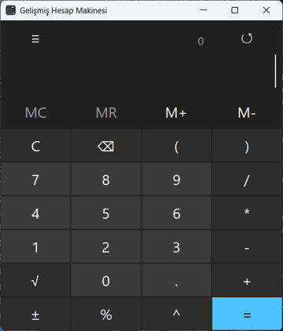
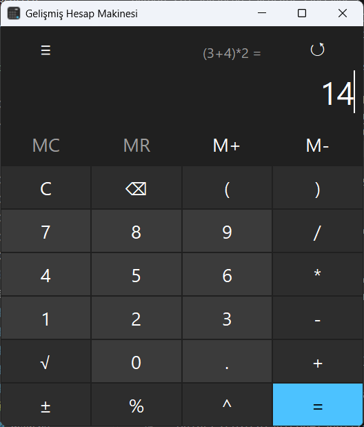
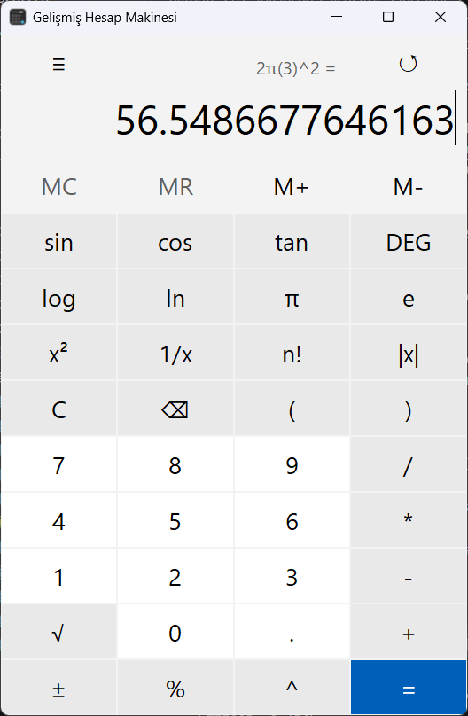
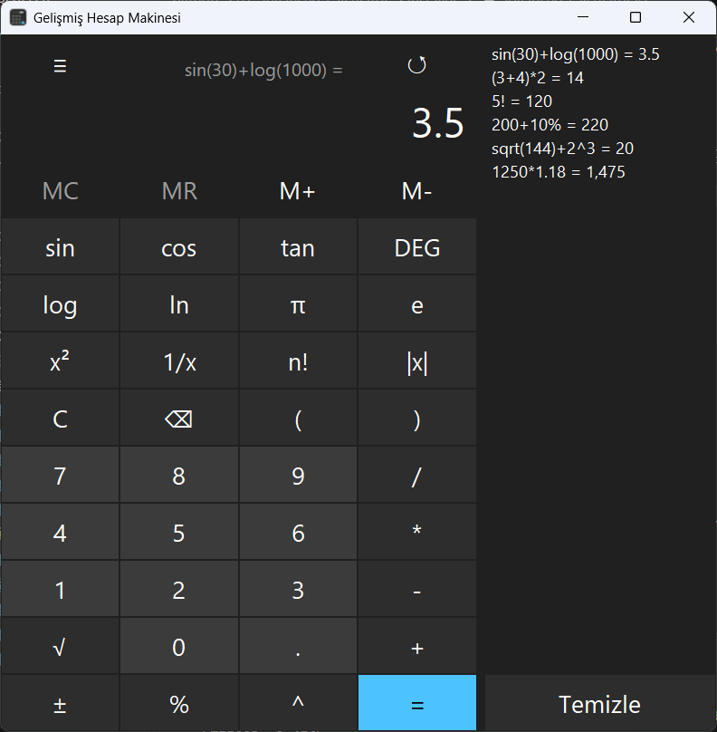

<p align="center">
  
</p>

<h1 align="center">Gelişmiş Hesap Makinesi</h1>

<p align="center">
  <a href="README.md">English</a> | <b>Türkçe</b>
</p>

<p align="center">
  Python ve Tkinter ile yazılmış, Windows hesap makinesinden esinlenen standart ve bilimsel hesap makinesi.<br>
  İfadeler <code>eval()</code> kullanılmadan, sıfırdan yazılmış bir ayrıştırıcı (parser) ile hesaplanır.
</p>

<p align="center">
  <a href="https://github.com/MrcDprm/advanced-calculator/releases/latest"><b>⬇️ Windows için indir</b></a>
</p>

<p align="center">
  
</p>

## Özellikler

**Hesaplama**
- Dört işlem, üs alma, parantezler ve doğru işlem önceliği (`2 + 3 * 4 = 14`)
- Örtük çarpma: `2(3)`, `(1+2)(3+4)`, `2π`
- Bilimsel fonksiyonlar: `sin`, `cos`, `tan` (derece / radyan), `log`, `ln`, `√`, `|x|`, `n!`, `x²`, `1/x`, `±`
- Sabitler: `π` ve `e`
- Yüzde, Windows ve Google'daki gibi çalışır: `200 + 10% = 220`
- Çok büyük ve çok küçük sayılar için bilimsel gösterim (`1e+25`), binlik ayırıcı (`1,234,567`)
- Kayan nokta gürültüsü temizlenir: `0.1 + 0.2 = 0.3`, `sin(180°) = 0`
- Anlaşılır Türkçe hata mesajları: sıfıra bölme, tanımsız işlemler, kapanmamış parantez vb.

**Arayüz**
- Standart ve bilimsel mod
- Açık ve koyu tema
- Geçmiş paneli: eski bir hesaba tıklayınca ekrana geri gelir
- Bellek tuşları: `MC`, `MR`, `M+`, `M-`
- Windows hesap makinesinin klavye kısayolları ve düğme ipuçları
- İmlecin olduğu yere yazma, fonksiyon adlarını tek seferde silme
- Güvenli kopyala / yapıştır
- Boyutlandırılabilir pencere
- Tema, mod, açı birimi ve geçmiş program kapansa da hatırlanır

**Diğer**
- Konsol sürümü (`main.py`)
- 17 birim testi
- Kurulum sihirbazı: Başlat menüsü kısayolu, kaldırma desteği

## Ekran Görüntüleri

| Standart (koyu) | Bilimsel (açık) |
|---|---|
|  |  |

**Bilimsel mod ve geçmiş paneli**



## Kurulum

1. [Releases](https://github.com/MrcDprm/advanced-calculator/releases/latest) sayfasından `AdvancedCalculator-x.y.z-Setup.exe` dosyasını indir.
2. Dosyayı çalıştır ve kurulum adımlarını izle. Yönetici izni gerekmez.
3. Programı Başlat menüsünde **Gelişmiş Hesap Makinesi** adıyla bulabilirsin.

> **Windows "bilgisayarınızı korudu" uyarısı:** Program dijital olarak imzalanmadığı için Windows SmartScreen ilk açılışta uyarı gösterebilir. **Ek bilgi → Yine de çalıştır** ile devam edebilirsin. Kaynak kodun tamamı bu depoda açıktır.

**Kaldırma:** Ayarlar → Uygulamalar → Yüklü uygulamalar → Gelişmiş Hesap Makinesi → Kaldır.
Geçmiş ve ayarlar `%USERPROFILE%\.advanced-calculator` klasöründe tutulur ve kaldırma sırasında silinmez.

## Klavye Kısayolları

| Tuş | İşlev | Tuş | İşlev |
|---|---|---|---|
| `Enter` veya `=` | Hesapla | `Esc` | Temizle |
| `Backspace` / `Delete` | Sil (fonksiyon adları bütün olarak silinir) | `Ctrl+C` / `Ctrl+V` | Kopyala / yapıştır |
| `s` / `o` / `t` | sin / cos / tan | `F3` / `F4` | Derece / radyan |
| `l` / `n` | log / ln | `p` / `e` | π / e |
| `q` | x² | `r` | 1/x |
| `@` | √ | `F9` | ± |
| `\|` | \|x\| | `!` / `%` | Faktöriyel / yüzde |
| `Ctrl+L` / `Ctrl+R` | Belleği temizle / bellekten oku | `Ctrl+P` / `Ctrl+Q` | Belleğe ekle / bellekten çıkar |
| `Ctrl+H` | Geçmiş paneli | `Alt+1` / `Alt+2` | Standart / bilimsel mod |

Ondalık ayırıcı olarak nokta kullanılır; klavyedeki virgül tuşu (numpad dahil) otomatik olarak nokta yazar.

## Kullanılan Teknolojiler

- **Python 3.12**: sadece standart kütüphane, harici paket yok
- **Tkinter**: arayüz
- **unittest**: birim testleri
- **PyInstaller**: Windows `.exe` derlemesi
- **Inno Setup**: kurulum sihirbazı

## Proje Yapısı

```
advanced-calculator/
├── gui.py          # Tkinter arayüzü
├── main.py         # Konsol arayüzü
├── tokenizer.py    # İfadeyi parçalara (token) ayırır
├── evaluator.py    # Token'ları işlem önceliğine göre hesaplar (recursive descent parser)
├── formatter.py    # Sonucu okunabilir biçimde gösterir
├── history.py      # İşlem geçmişini tutar
├── storage.py      # Geçmiş ve ayarları JSON dosyasına kaydeder
├── tooltip.py      # Düğme ipuçları
├── app_info.py     # Uygulama adı, sürüm, kaynak dosya yolları
├── assets/         # Uygulama ikonu
├── docs/           # README görselleri
├── installer/      # Inno Setup kurulum betiği
└── tests/          # Birim testleri
```

## Kaynak Koddan Çalıştırma

Python 3.12 veya üstü gerekir.

```bash
python gui.py     # arayüz
python main.py    # konsol sürümü
python -m unittest -v    # testler
```

### Kurulum dosyası oluşturma

[PyInstaller](https://pyinstaller.org) ve [Inno Setup 6](https://jrsoftware.org/isinfo.php) gerekir.

```bash
python -m pip install pyinstaller
python -m PyInstaller --noconfirm AdvancedCalculator.spec
ISCC installer/advanced-calculator.iss
```

Kurulum dosyası `installer/Output/` klasöründe oluşur.

**Yeni sürüm yayınlarken:** sürüm numarasını hem `app_info.py` (`VERSION`) hem de `installer/advanced-calculator.iss` (`AppVersion`) dosyasında güncelle, testleri çalıştır, iki derleme komutunu çalıştır ve oluşan kurulum dosyasını yeni bir GitHub Release'e yükle.

## Öğrendiklerim

- **Bir hesap makinesi aslında küçük bir dil çözümleyicisidir.** Önce metni parçalara (token) ayırmayı, sonra her öncelik seviyesi için ayrı bir fonksiyon yazarak işlem önceliğini sağlamayı öğrendim (recursive descent parser). `eval()` kullanmak tek satırlık iş olurdu ama hem güvensiz hem de öğretici değil.
- **Bilgisayarlar ondalık sayıları tam tutamaz.** `0.1 + 0.2` işleminin `0.30000000000000004` çıkmasının nedenini ve sonuçları doğru gösterebilmek için yuvarlamanın, "sıfıra çok yakın" kontrollerinin neden gerektiğini gördüm.
- **Kodu görevlerine göre dosyalara ayırmak işe yarıyor.** Hesaplama kodunu ayrı yazdığım için konsoldan arayüze geçerken hesaplama tarafına hiç dokunmadım.
- **Tkinter ile masaüstü arayüzü.** Izgara yerleşimi (`grid`), olaylar (`bind`), `StringVar`, temalar ve kendi tooltip bileşenimi yazmayı öğrendim. Döngü içinde `lambda` kullanırken yaşanan "closure tuzağını" ve Python'da girintinin ne kadar önemli olduğunu yaşayarak öğrendim.
- **"Çalışıyor" ile "kullanıcı dostu" arasında büyük fark var.** İmlecin nerede durduğu, hatadan sonra ne olacağı, klavye kısayolları, Türkçe klavyede virgül tuşu gibi küçük detayları düşünmek işin büyük kısmıydı.
- **Hataları kullanıcıya anlaşılır göstermek.** `try/except` ile hataları yakalayıp Türkçe mesajlara çevirmeyi, programın bozuk bir ayar dosyası yüzünden çökmemesini sağlamayı öğrendim.
- **Otomatik testler.** `unittest` ile testler yazmayı, test sırasında gerçek dosyalarıma dokunmamak için `mock` kullanmayı öğrendim. Testler, sonradan yaptığım bir değişikliğin eski bir özelliği bozup bozmadığını anında gösteriyor.
- **Bir programı dağıtmak.** PyInstaller ile Python kurulu olmayan bilgisayarlarda çalışan bir `.exe` oluşturmayı, Inno Setup ile kurulum sihirbazı hazırlamayı ve kullanıcı verisini neden program klasörüne değil kullanıcı klasörüne kaydetmek gerektiğini öğrendim.
- **Git ile düzenli çalışmak.** Her adımı küçük ve anlamlı commit'lerle kaydetmeyi ve Conventional Commits biçimini kullanmayı alışkanlık hâline getirdim.

## Gelecek Planları

- Sonuç uzadıkça yazı boyutunun otomatik küçülmesi
- Ters trigonometrik fonksiyonlar (`asin`, `acos`, `atan`) ve hiperbolik fonksiyonlar
- Programcı modu (ikilik, sekizlik, onaltılık sayı sistemleri)
- Birden fazla bellek kaydı (`MS` ve bellek listesi)
- İngilizce arayüz seçeneği
- macOS ve Linux için paketler

## Lisans

[MIT](LICENSE) © 2026 Miraç Deprem
